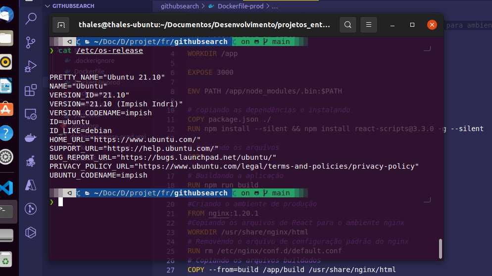

# Descrição da aplicação react

* O projeto consiste em uma tela única básica, onde o usuário pode pesquisar um determinado repositório dentro do github.Caso deseje, também pode pesquisar pelo nome do repositório junto com o nome do autor do repositório.
* Como resultado da pesquisa, ele trás informações as informações:
    - Linguagem que foi utilizada
    - Quantidade de forks
    - Tamanho
    - URL
    - Login do criador
    - Foto do perfil do criador.

* Utilizou-se o framework react-js com typescript

## Executar Projeto fora do ambiente de container:

* Instalação das dependências do reactjs e typescript:
```
    yarn install ou npm install
```
* Executar projeto:
```
yarn start ou npm run start
```

## Executar Projeto com Docker-compose:

## Subindo os containers em ambiente de desenvolvimento:

* Sem stack

```
    docker-compose up -d
```


* Sem com nome da stack

```
    docker-compose -p {nome_da_stack} up -d
```

- obs 1: -d serve apenas para que o terminal suba os containers e não fique "travado" na tela de log.
- obs 2: Nome da stack é totalmente opcional mas facilita ao deixar os containers que tem alguma relação separados por grupos, melhorando o controle, principalmente em ferramentas como portainer.

* Acessar pelo endereço:
```
    http://localhost:7887
```

## Subindo os containers em ambiente de produção, utilizando Nginx:


* Sem stack

```
    docker-compose -f docker-compose-prod.yml up -d
```


* Sem com nome da stack

```
    docker-compose -p {nome_da_stack} -f docker-compose-prod.yml up -d
```

- obs 1: -d serve apenas para que o terminal suba os containers e não fique "travado" na tela de log.
- obs 2: Nome da stack é totalmente opcional mas facilita ao deixar os containers que tem alguma relação separados por grupos, melhorando o controle, principalmente em ferramentas como portainer.

* Acessar pelo endereço:
```
    http://localhost:8080
```


### Parando a execução dos containers
```
    docker-compose down
```


### O projeto foi feito e testado utilizando ubuntu 21.10, como consta na imagem:

